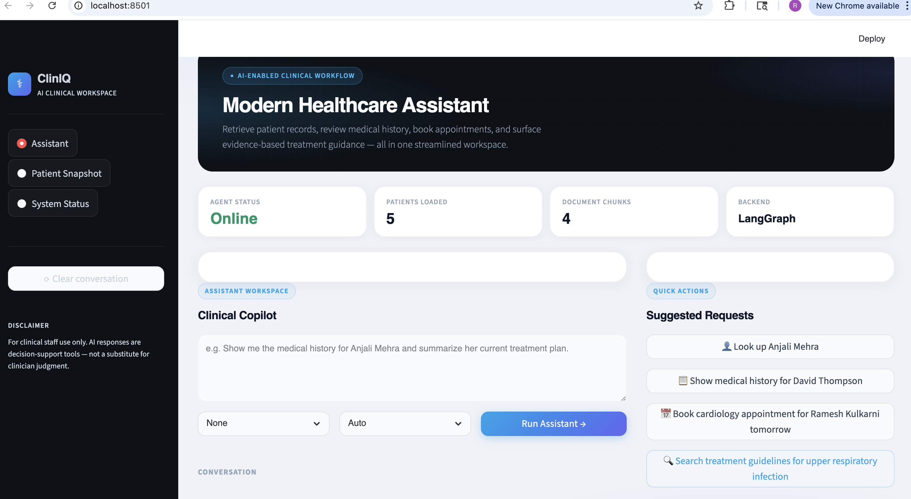
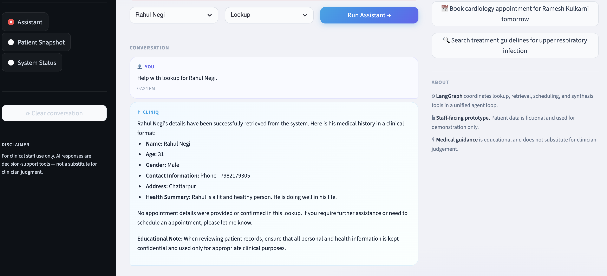
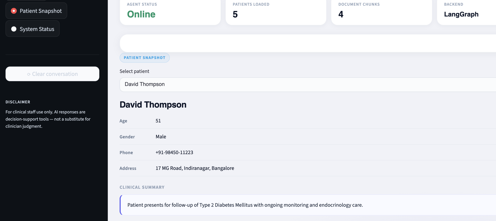
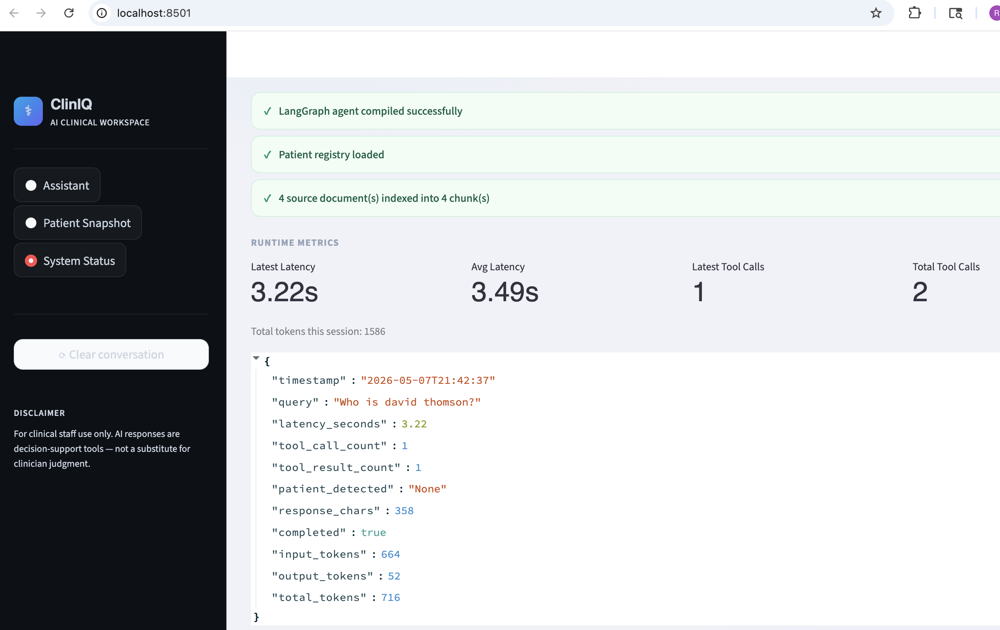

# 🏥 Agentic AI Healthcare Assistant

An AI-powered healthcare assistant built using LangGraph that performs multi-step reasoning, retrieves patient data, and generates structured responses through tool-based workflows.

This project demonstrates how modern LLM-based systems can move beyond simple chat interactions into **stateful, tool-augmented agents** capable of handling real-world workflows.

---

## 📌 Project Overview

This assistant simulates a healthcare support system that can:

- Retrieve patient records from a registry
- Analyze symptoms and provide structured responses
- Maintain conversational state across interactions
- Dynamically invoke tools based on user intent

The system is designed using an **agentic architecture**, where decisions are made step-by-step using a state machine powered by LangGraph.

---

## 🧠 Architecture & Flow

**Core Flow:**

1. User submits a query (symptoms, patient lookup, etc.)
2. Agent processes input and determines next step
3. Tools are invoked as needed:
   - Patient lookup
   - Document retrieval (RAG)
   - Scheduling logic
4. State is updated across steps
5. Final response is generated and returned

---

## 🤖 Why LangGraph?

This project uses LangGraph to model the assistant as a stateful workflow rather than a simple chain.

This enables:

- Multi-step reasoning across complex tasks
- Conditional routing based on intermediate results
- Tool invocation with structured state tracking
- Greater reliability compared to single-pass LLM calls

This approach reflects how production-grade AI systems are increasingly built—moving beyond prompt chains into orchestrated agent workflows.

---

## ⚙️ Tech Stack

- **LLM / Agent Framework:** LangGraph, LangChain
- **Model:** OpenAI (Chat-based LLM)
- **Vector Store:** FAISS
- **Frontend:** Streamlit UI
- **Language:** Python

---

## 🔑 Key Features

- Stateful agent workflow using LangGraph
- Tool-based reasoning and execution
- Retrieval-Augmented Generation (RAG)
- Patient memory across sessions
- Interactive UI for real-time querying
- Runtime performance tracking

---

## 📊 Performance & Observability

The system includes built-in runtime metrics to evaluate performance and behavior:

- ⏱️ Average latency per query
- 🔧 Tool invocation tracking (per query + total session)
- 🧮 Token usage monitoring
- ✅ Response completion tracking
- 🧠 Patient detection validation

These metrics are displayed directly in the UI to support debugging and system optimization.

---

## 🖥️ Demo






---

## 💬 Example Interaction

**User Input:**
"Pull patient info for Anjali and summarize her condition"

**System Behavior:**

- Detects patient name
- Calls patient registry tool
- Retrieves associated records
- Generates structured summary

**Output:**
"The patient information for Anjali Mehra is as follows:

- Name: Anjali Mehra
- Age: 33
- Gender: Female
- Phone: +91-98180-11245
- Address: 202 Lakeview Apartments, Pune

Current Condition Summary: Anjali Mehra presents with a 5-day history of dry cough and mild fever. She has been diagnosed with an Upper Respiratory Infection (J06.9).

Treatment Guidance:

- Symptomatic management with antihistamines
- Increase fluid intake
- Ensure adequate rest
- Follow-up appointment in 5 days"

---

## 🧪 Testing

Basic unit tests are included to validate core functionality.

Run tests:

```bash
PYTHONPATH=src python3 -m pytest tests/
```

---

## 🛠️ Installation & Setup

1. Clone the repository

   ```bash
   git clone https://github.com/rico-ramos/healthcare-ai-assistant.git
   cd healthcare-ai-assistant
   ```

2. Create virtual environment

   ```bash
   python3 -m venv .venv
   source .venv/bin/activate
   ```

3. Install dependencies

   ```bash
   pip install -r requirements.txt
   ```

4. Set environment variables

   Create a .env file:

   ```bash
   cp .env.example .env
   ```

   Add your OpenAI key to `.env`:

   ```bash
   OPENAI_API_KEY=your_api_key_here
   ```

---

## ▶️ Running the App

```bash
PYTHONPATH=src streamlit run app.py
```

---

## 📂 Project structure

```text
healthcare_ai_assistant_clean/
├── app.py                          # Streamlit UI
├── data/
│   ├── records.csv
│   └── patient_reports/
├── notebooks/
│   └── Capstone_Healthcare_Assistant_RAMOS_original.ipynb
├── scripts/
│   └── smoke_test.py               # OpenAI-free sanity check
├── src/healthcare_ai_assistant/
│   ├── config.py
│   ├── registry.py
│   ├── documents.py
│   ├── scheduling.py
│   ├── tools.py
│   ├── graph.py
│   ├── memory.py
│   ├── runner.py
│   └── cli.py
│
├── tests/
│   └── test_registry.py            # Unit test for registry logic
│
├── .env.example
├── requirements.txt
└── README.md
```

---

## 🚧 Future Improvements

- Expand evaluation framework for response accuracy
- Add multi-patient conversational context handling
- Improve UI with agent reasoning visualization
- Integrate structured medical knowledge base

---

## 💡 Why This Project Matters

This project demonstrates the shift from simple LLM-powered applications to **agentic systems capable of reasoning, tool use, and state management**.

Rather than relying on single prompts, the assistant:

- Breaks problems into steps
- Uses tools to gather information
- Maintains context across interactions
- Produces structured, reliable outputs

These patterns are foundational to modern AI engineering and production AI systems.
